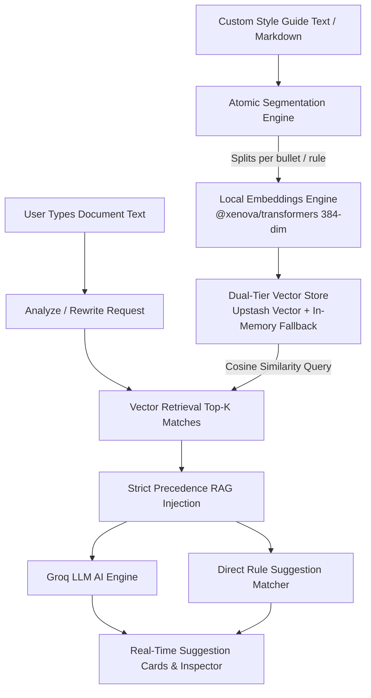

# Grammar Master (writ.ai)

Grammar Master is a modern AI-augmented writing and cognitive workspace built with Next.js 15, React 18, and Groq LLMs. It delivers real-time grammar checking, style rule enforcement, tone rewriting, document statistics, and custom organization-level **Style Guide & Glossary RAG (Retrieval-Augmented Generation)**.

---

## Table of Contents

- [Features](#features)
- [Style Guide & Glossary RAG Architecture](#style-guide--glossary-rag-architecture)
- [Tech Stack](#tech-stack)
- [Getting Started](#getting-started)
- [Environment Variables](#environment-variables)
- [Vector & Redis Store Configuration](#vector--redis-store-configuration)
- [Running Locally](#running-locally)
- [Testing](#testing)
- [Deployment](#deployment)
- [Scripts](#scripts)

---

## Features

- **Real-Time Document Analysis & Inspector**: Real-time readability scores, spelling & grammar checks, word counts, and detected tone analysis (Formal, Confident, Friendly).
- **Style Guide & Glossary RAG**: Upload, edit, and enforce custom company or project style rules (e.g., *"Use 'eBPF', never 'Ebpf'"*, *"Always write 'PostgreSQL' instead of 'Postgres'"*).
- **Atomic Rule Chunking & Vector Search**: Automatic segmentation into atomic rules with local 384-dimensional dense vector embeddings (`all-MiniLM-L6-v2`).
- **AI Text Modification & Copilot**: Expand, shorten, formalize, simplify, or rewrite selections using Groq's high-speed LLM inference (`openai/gpt-oss-120b`).
- **Interactive Document Editor**: Native contentEditable workspace with caret stabilization and instant suggestion acceptance.
- **Export Formats**: One-click document export to `.docx`, `.pdf`, and `.txt`.
- **Production-Ready Rate Limiting**: Dual-tier rate limiting with Upstash Redis and in-memory fallback for local development.

---

## Style Guide & Glossary RAG Architecture



1. **Atomic Rule Ingestion**: Raw guidelines are parsed and stripped of Markdown formatting into discrete atomic rules.
2. **Dense Vector Embeddings**: Each rule is converted into a normalized 384-dim vector using `@xenova/transformers` running locally in Node.js without external API costs.
3. **User-Isolated Vector Storage**: Vectors and metadata are stored in Upstash Vector (or a global singleton in-memory store in dev).
4. **Strict Precedence Prompting**: Retrieved style rules override general grammar suggestions to strictly preserve brand terminology and casing.

---

## Tech Stack

| Layer | Technology |
|---|---|
| **Framework** | Next.js 15 (App Router), React 18, TypeScript |
| **Styling** | Tailwind CSS + Glassmorphism / Aurora design system |
| **Database** | MongoDB + Mongoose |
| **Vector Search / RAG** | Upstash Vector + `@xenova/transformers` (`all-MiniLM-L6-v2`) |
| **AI Inference** | Groq SDK (`openai/gpt-oss-120b`, `llama-3.3-70b-versatile`) |
| **Rate Limiting** | Upstash Redis (production) + In-memory fallback |
| **Testing** | Jest, React Testing Library |

---

## Getting Started

### Prerequisites
- Node.js 18.18+ or Node.js 20+
- MongoDB instance (local or MongoDB Atlas)
- Groq API Key ([Groq Console](https://console.groq.com))

### 1. Clone & Install
```bash
git clone https://github.com/daivikawasthi01/Grammar-Master.git
cd Grammar-Master
npm install
```

### 2. Configure Environment
```bash
cp .env.example .env.local
```

Fill in your configuration in `.env.local` (see [Environment Variables](#environment-variables)).

### 3. Run Development Server
```bash
npm run dev
```

Open [http://localhost:3000](http://localhost:3000) in your browser.

---

## Environment Variables

| Variable | Required | Description |
|---|---|---|
| `MONGODB_URI` | Yes | MongoDB connection string (local or Atlas) |
| `JWT_SECRET` | Yes | Secret used for signing JWT auth tokens |
| `NEXTAUTH_SECRET` | Yes | Random secret for NextAuth session encryption |
| `NEXTAUTH_URL` | Yes | Base URL (`http://localhost:3000` in dev, production URL in prod) |
| `GROQ_API_KEY` | Yes | API key from Groq for LLM analysis & suggestions |
| `UPSTASH_VECTOR_REST_URL` | Optional | Upstash Vector REST endpoint for scalable style rule RAG |
| `UPSTASH_VECTOR_REST_TOKEN` | Optional | Upstash Vector REST read/write token |
| `UPSTASH_REDIS_REST_URL` | Optional | Upstash Redis REST URL for production rate limiting |
| `UPSTASH_REDIS_REST_TOKEN` | Optional | Upstash Redis REST token |

```env
# Database & Auth
MONGODB_URI=mongodb://127.0.0.1:27017/grammar-master
JWT_SECRET=your-random-jwt-secret
NEXTAUTH_SECRET=your-random-nextauth-secret
NEXTAUTH_URL=http://localhost:3000

# Groq AI
GROQ_API_KEY=gsk_your_groq_api_key

# Optional: Upstash Vector & Redis (In-memory fallback used if omitted)
UPSTASH_VECTOR_REST_URL=https://your-vector-index.upstash.io
UPSTASH_VECTOR_REST_TOKEN=your_upstash_vector_token
UPSTASH_REDIS_REST_URL=https://your-redis.upstash.io
UPSTASH_REDIS_REST_TOKEN=your_upstash_redis_token
```

---

## Testing

Run the automated test suite covering embeddings, vector stores, atomic rule segmentation, and style guide endpoints:

```bash
npx jest src/lib/ src/app/api/style-guide/
```

---

## Scripts

| Command | Description |
|---|---|
| `npm run dev` | Start development server with Turbopack / Next.js |
| `npm run build` | Compile Next.js production build |
| `npm run start` | Start production server |
| `npm test` | Run Jest unit and integration tests |

---

## License

MIT